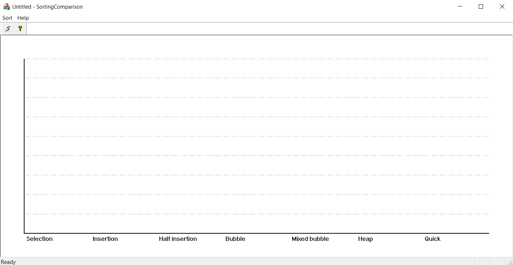
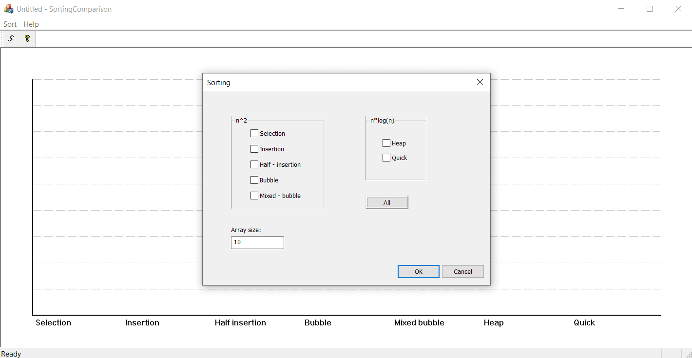
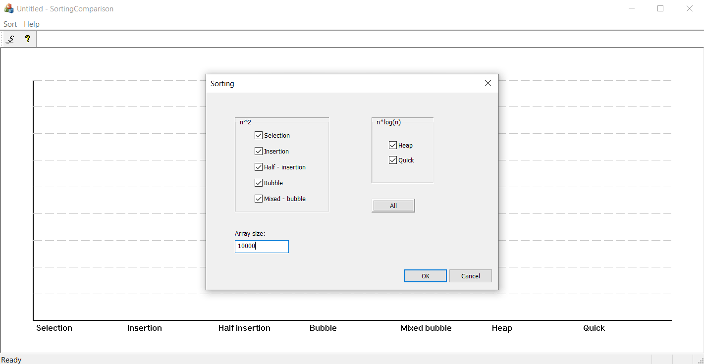
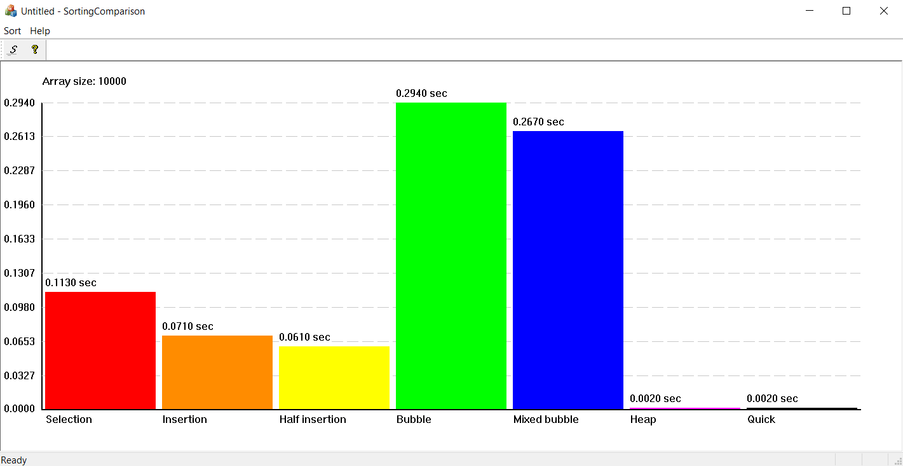
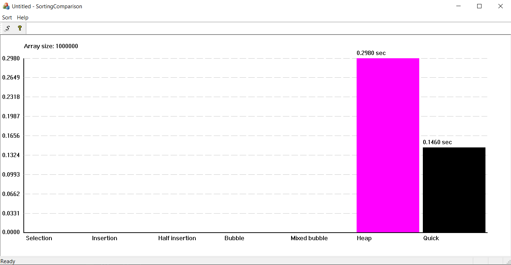

# MFC-animation
Project in C++/MFC for University - Windows programming - class
Written in VS 2019  
<b>!! Not tested anywhere else than VS 2019 !!</b>

# Description
This is a simple programme using MS MFC library that creates single document solution.

 

To set the params of the sorting operation, a dialog window is implemented and hidden
behind the "S" icon - or menu: Sort -> properties.

 

Its use is trivial, so without further ado, simple example:

 

 

Heap & Quick sorts are too fast, so once again but with bigger array:

 

Everytime user inserts new data in dialog window and presses OK, the algorithms go to work
 
<b>BUT</b>
 
if the array is too small 
 
(working time <= 0.001 sec)
 
<b>OR</b>
 
none of the methods are checked, 
 
main window will just clear itself and wait for further instructions
   

 